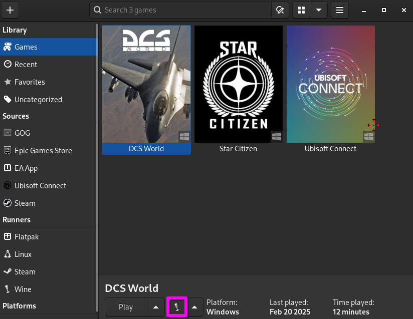

# DCS Standalone on Linux Via Wine(Lutris)/Proton(Steam)
#### Any and all refrences to Steam, are not relating to the Steam version of the game.

DCS World can run on linux through Wine and Proton, though it does take some
work to get running and if you want to use VR I highly recommend using Proton(Steam) as opposed to Wine, if anything dosen't work, make sure I cannot stress this enough
CHECK all your log files.

Thanks to everyone who has helped getting the game running and debugging issues
in the [Proton issuetracker](https://github.com/ValveSoftware/Proton/issues/1722)
and in the [Matrix chat](https://matrix.to/#/#dcs-on-linux:matrix.org).  
Unfortunately, workarounds easily get buried there and the OG of this Doc is outdated  
(I will try to keep this one up to date but I make no promises)  

## Contents

   * [Installation](#Getting-it-installed-via-Lutris)
      * [Lutris](#getting-it-working-with-Lutris)
      * [Black screen Launcher bypass](#Black-screen-launcher-bypass)
      * [Voice-Chat-Bug](#Voice-Chat-Bug)
      * [Porting to Steam](#Porting-to-Steam)
   * [Bugs and Fixes](#known-issues-and-fixes)
      * [Broken Contrails](#Contrails-are-puffy/broken-up)
      * [fx_5_0 error](#fx_5_0-error-shaders-not-compiling)
      * [Apache Crashes Game](#Apache-crashes-game)
   * [Vr References](#Vr-References)
   * [3rd party programs/tools](#3rd-party-programs/tools)
      * [Opentrack](#Opentrack)
   * [Installing Mods](#Installing-Mods)
## Getting it installed via Lutris

There are [two install scripts
for standalone](https://lutris.net/games/dcs-world/) on Lutris

I used the latter labeled Standalone Open Beta version, but they both should work
as DCS no longer has an "OpenBeta" and I believe that the install scripts may be borked.
this will download, the DCS updater and you should install the game

### Getting it working with Lutris

Standalone install needs some Winetricks applied.    
Start the game once first to create the prefix([here](https://wiki.archlinux.org/title/Wine#WinePREFIX) for an explination of what a prefix is), then use lutris's Winetricks
to add these .dll and font.
```
vcrun2019 corefonts xact d3dcompiler_43
```
you can open Winetricks in lutris by clicking on DCS Do not open, 1 LMB click only, then click on the Wine glass at the bottom of the screen  


You need to add a "dll override" aswell. As of 2.9.12, `wbemprox=n` needs to be overridden.
In lutris, you can do so under "runner options".


#### (updated for 2.9.12.5336)

If you plan on using DCS with a VR headset you'll want to use Proton and the easiest way i've found
to get it working, is through Steam(not the Steam version of the game but adding
the game to Steam) however keep working with Wine and Lutris for now

If you would rather use headtracking via opentrack  
I'd recommend you keep using Wine as opentrack does not support the steam method

before you move on, you should have an install via lutris that opens the DCS_Updater.exe
make sure you have used it to install the game files at this point and duplicate the confg
in lutris, then change the duplicated lutris config to launch the DCS.exe MT or not, dosen't matter
we will be working with the duplicated one, not the original

## Black screen launcher bypass

So at this point you should get a black screen a little bit smaller than your display that'll be the launcher
you'll need to add this the the launch arguments of Lutris `--no-launcher`
you can do so under "game options" in the arguments field


With that change, you should be able to log in but once the game starts you
will see a black screen. you have two options from here, proceede with Wine or use Proton under Steam(Recommended for VR)

## Voice Chat Bug
### NOTE: the following dosen't seem to always be an issue
#### If you proceede  you will have to redo this step every time you repair the game and possibly when ED updates the optionDB.lua
see [Porting to Steam](#Porting-to-Steam) for using Proton(Via Steam), just skip this step

I have a workaround for this problem however it removes the in game voice chat functionality
witch I find to be a downside but `¯\_(ツ)_/¯`

you'll need to modify the optionsDB.lua(modified ver included at the top of page) located at   
```/INSTALL_DIR/MissionEditor/modules/Options/optionsDb.lua```  
and remove the calls to voicechat on lines 118-129 and 453 look for the lines highlighted in the following 2 pictures,


The game should now start.


## Porting-to-Steam

so first thing you're gonna want to do is add the DCS.exe as a Steam game


then add these launch options(some debug info, and the no launcher option from before)  
```WineDLLOVERRIDES="wbemprox=n" WineDEBUG="+timestamp,+pid,+tid,+seh,+debugstr,+module" %command% --no-launcher```  
optionally you can add the gamemoderun command, however that requres you have gamemode installed  
```WineDLLOVERRIDES="wbemprox=n" WineDEBUG="+timestamp,+pid,+tid,+seh,+debugstr,+module" gamemoderun %command% --no-launcher```  

also I found the most sucess with Proton experimental but try different ones out see what works

now that that's done, launch it to create the prefix in Steam
you need to add the userdata from the Wine prefix to the Steam prefix

Steam Proton prefixes are stored in the compatdata folder usually around here   
```/home/<USRNAME>/.local/share/Steam/Steamapps/compatdata/```   
now once you're there, youll see a lot of numbered folders, one of those is the
new DCS prefix, it's probably going to be one of the longer ones  
it might be easier to find yours if you sort by creation date it should be the first/last one.

now that you've found the Steam Proton prefix, you need to link(I used a symlink) the Saved Games folder   
```/pfx/drive_c/users/Steamuser/Saved Games/```   
to the one in your lutris install for instance the command I used in arch was:   
```<USERNAME>@PC ~> ln -s /home/<USERNAME>/Games/dcs-world/drive_c/users/<USERNAME>/Saved\ Games/ /home/<USERNAME>/.local/share/Steam/Steamapps/compatdata/2824223594/pfx/drive_c/users/Steamuser/```  
### On Arch a filepath with spaces can either be added with ["/File Path/"] or [/File\ Path/] different systems may vary, check your respective wiki
(honesly linking everything from the Wine prefix will be neccisary but if your lazy like me just copy paste all the relevant folders from the Wine prefix to the Proton one).

## Known issues and fixes

If things go wrong, the primary thing to look for is the game log - 
`drive_c/users/$USERNAME/Saved Games/DCS<possibly openbeta>/Logs/dcs.log`.
After crashes, the crash reporter will spam a bit about various DLLs being used
recently, and just before that, the cause of the crash should be visible and if that
yelds no result try turning it off and back on again(your PC/Device) lol.

for troublshooting issues with steam try adding these environment variables
```
PROTON_LOG=1
PROTON_LOG_DIR=/path-to-desired-directory/
```
set that directory and steam will dump log files there

Sometimes crashes happen before the game gets far enough to create a log file.
Then your best bet is to read the Proton/Wine output. You can easily get
this by starting them from a terminal.

If you can't find your issue, or have found a solution for one, please discuss it in
the [matix](https://matrix.to/#/#dcs-on-linux:matrix.org) chat or in [ED's Discord server](https://discord.com/invite/eagledynamics) so I can update the guide

## Contrails are puffy/broken up
yeah it's like that, i dont know why but it can be ignored if you fix it let me know supposably there's a fix, I'll update the guide when it is made to work and I can confirm it

## fx_5_0 error shaders not compiling
this is usually caused by a missing Wine/Proton trick, make sure you have all of the Wine/Proton tricks, 
if that still dosent work try launching the DCSupdater.exe via lutris

## Apache crashes game
This is caused by a missing font, `seguisym.ttf` it is a font that is not avalable for redistribution, ie: cannot be legally obtained on Linux so I unfortunately cannot tell you how to obtain it
but if you can get your hands on a copy of `C:/Windows/Fonts` than that will fix your issue, you can also use an existing font on your disto that supports all of the required characters and rename it to `seguisym.ttf`  

However the MFD's on the apache will still be broken, this requires the script below. 

## Fixing broken textures in cockpits
some textures will not render due to RGBA values outside valid ranges, this requires a script to convert the textures so that they are compatable with Wine/Proton
rendering pipelines, unfortunately this breaks Pure Texture IC see the original post [here](https://github.com/ValveSoftware/Proton/issues/1722#issuecomment-2116194839), you will need to redo this every time you repair the game as it will overwrite these rexported textures with the original ones
to convert the textures so that they are compatable with Wine/Proton

you will need the [imagemagick](https://imagemagick.org/index.php) package and you will likely need to edit the scripts contained install path so that it works on your install of DCS.

Current list of known affected airframes requiring this script:
```
F/A-18C
AH-64D
MI-24P
KA-50
```

[Original Script](https://github.com/ValveSoftware/Proton/issues/1722#issuecomment-2116194839)  
[Edited Script](DCSApachetextureconvert.txt):  
```
#!/bin/bash

DCS_INSTALL="/home/<USERNAME>/Games/dcs-world/drive_c/Program Files/Eagle Dynamics/DCS World OpenBeta"

BROKEN_FILES="Mods/aircraft/AH-64D/Cockpit/IndicationResources/Displays/MPD/FontMPD_64.tga
Mods/aircraft/AH-64D/Cockpit/IndicationResources/Displays/EUFD_font.dds
Mods/aircraft/AH-64D/Cockpit/IndicationResources/Displays/KU_font_8p.dds
Mods/aircraft/AH-64D/Cockpit/IndicationResources/Displays/TADS_symbology.dds
Mods/aircraft/AH-64D/Cockpit/IndicationResources/Displays/TEDAC/TEDAC_day.dds
Mods/aircraft/AH-64D/Cockpit/IndicationResources/Displays/TEDAC/TEDAC_FCR_indication_font.dds
Mods/aircraft/AH-64D/Cockpit/IndicationResources/Displays/TEDAC/TEDAC_FCR_Target_font.dds
Mods/aircraft/AH-64D/Cockpit/IndicationResources/Displays/TEDAC/TEDAC_font.dds
Mods/aircraft/AH-64D/Cockpit/IndicationResources/Displays/TEDAC/TEDAC_night.dds
Mods/aircraft/AH-64D/Cockpit/IndicationResources/Displays/TEDAC/TEDAC_symbology.dds
Mods/aircraft/AH-64D/Cockpit/IndicationResources/Displays/MPD/FontMPD_64_inv.tga
Mods/aircraft/AH-64D/Cockpit/IndicationResources/Displays/MPD/FontMPD_64_inv_bold.tga
Mods/aircraft/AH-64D/Cockpit/IndicationResources/Displays/MPD/indication_MPD.tga
Mods/aircraft/AH-64D/Cockpit/IndicationResources/Displays/MPD/indication_MPD_1024.dds
Mods/aircraft/AH-64D/Cockpit/IndicationResources/Displays/MPD/indication_MPD_WPN.tga
Mods/aircraft/AH-64D/Cockpit/IndicationResources/Displays/MPD/indication_MPD_WPN_fon.tga
Mods/aircraft/AH-64D/Cockpit/IndicationResources/Displays/MPD/MFD_dark_green.dds
Mods/aircraft/AH-64D/Cockpit/IndicationResources/Displays/MPD/MFD_gray.dds
Mods/aircraft/AH-64D/Cockpit/IndicationResources/Displays/MPD/MFD_green.dds
Mods/aircraft/AH-64D/Cockpit/IndicationResources/Displays/MPD/MFD_white.dds
Mods/aircraft/AH-64D/Cockpit/IndicationResources/Displays/MPD/MPD_FCR_indication_font.dds
Mods/aircraft/AH-64D/Cockpit/IndicationResources/Displays/MPD/MPD_FCR_Target_font.dds
Mods/aircraft/AH-64D/Cockpit/IndicationResources/Displays/MPD/MPD_VideoSymbology.dds
Mods/aircraft/AH-64D/Cockpit/IndicationResources/Displays/MPD/MPD_VideoSymbology_font.dds
Mods/aircraft/Mi-24P/Cockpit/IndicationTextures/9K113_bg.tga
Mods/aircraft/Mi-24P/Cockpit/IndicationTextures/9K113_Fixed_Grid.tga
Mods/aircraft/Mi-24P/Cockpit/IndicationTextures/9K113_Grid_3x.tga
Mods/aircraft/Mi-24P/Cockpit/IndicationTextures/9K113_Grid_3x_backlight.tga
Mods/aircraft/Mi-24P/Cockpit/IndicationTextures/9K113_Grid_10x.tga
Mods/aircraft/Mi-24P/Cockpit/IndicationTextures/9K113_Grid_10x_backlight.tga
Mods/aircraft/Mi-24P/Cockpit/IndicationTextures/9K113_Ready.tga
Mods/aircraft/Mi-24P/Cockpit/IndicationTextures/ASP17_flex_sight.tga
Mods/aircraft/Mi-24P/Cockpit/IndicationTextures/font_arcade.tga
Mods/aircraft/Mi-24P/Cockpit/IndicationTextures/font_general.tga
Mods/aircraft/Mi-24P/Cockpit/IndicationTextures/GOST_BU.TTF
Mods/aircraft/Mi-24P/Cockpit/IndicationTextures/HelperAI_common.dds
Mods/aircraft/Mi-24P/Cockpit/IndicationTextures/PKV_Grid.tga
Mods/aircraft/Ka-50_3/Cockpit/IndicationTextures/SHKVAL_MASK.bmp
Mods/aircraft/FA-18C/Cockpit/IndicationResources/MDG/font_TGP_ATFLIR.tga"

while read -r file; do
    FULL_PATH="$DCS_INSTALL/$file"
    echo "Converting ${FULL_PATH}"
    cp "${FULL_PATH}" "${FULL_PATH}.original"
    magick "${FULL_PATH}" "${FULL_PATH}"
done <<< "$BROKEN_FILES"
```

# Vr References

As far as VR on linux is concerned your milage may vary but, if you havent at least attempted it before
this should get you started .[LVRA](https://discord.gg/qdUWFe4RDV)

# 3rd party programs/tools

## Headtracking
Opentrack is a 3rd party headtracking software that can use TrackIR hardware
https://github.com/markx86/opentrack-launcher?tab=readme-ov-file#with-Steam-flatpak

An alternative is Linuxtrack https://github.com/uglyDwarf/linuxtrack by uglyDwarf or the more up to date fork at https://github.com/RavenX8/linuxtrack

## Simple Radio Standalone (SRS)
Option one is to install it directly into the prefix of your DCS install, and while messy, is fully functional.

Option two is to install it standalone. This option has complications in that it will not technically connect to DCS in the expected way, so servers that check to see a user is running SRS or may not see that correctly, as they appear to the server as a GCI, not a client, due to the naming. This will result in inability to play on certain servers autokicking for lack of SRS. (namely grayflag)

# Installing Mods
Install [Limo](https://github.com/limo-app/limo) and use it like you would use OpenModManager or previously the deprecated OvGME on windows. Limo also offers the ability to add additional tools like wine launches, and shell scripts, to make a gui for updating/repairing/launching the game, and running the texture fixing script above. A Flatpac verson is available and has no known drawbacks for use with DCS. Limo is a generic mod manager that supports case-detection to remove the need for case-folding for modding to prevent breaking the game. The deployers can use hardlink, symlink, or copy the files in. The location to place the files is the same as on windows, and if you are familliar with OMM then limo will feel right at home.

For mods in the saved games folder that should be untouched by DCS, I recommend hardlink, case matching deployers, unless the files may be modified (ie using mods that modify other mods like armed blackhawk) then you would want to use copy with case matching. For mods in the game directory, I recommend using copy with case matching deployer, as its possible forgetting to uninstal before an update could modify/delete some of the files if they overlap vanilla assets.

the case matching deployer will prevent issues with case-folding, where windows is case insensitive, linux is case sensitive, meaning we may have multiple files named the same if the case is different. IE: file.txt, File.txt, and FILE.txt are all unique files. if the game sees this and attempts to load a file, it may crash, or behave unexpectedly when faced with multiple files when it expects one file. To fix this, we either use case-matching deployers for mods, or we use case-folding filesystems. If you have configured your filesystem for case-folding, then the case matching is not nessisary for you, and simple will work fine for you to save time checking the name twice.
