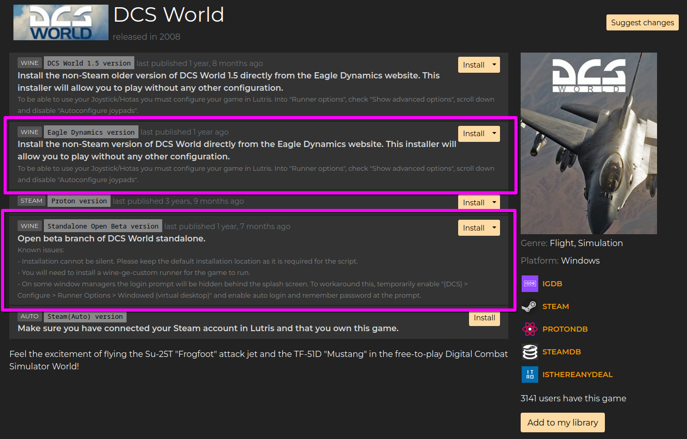
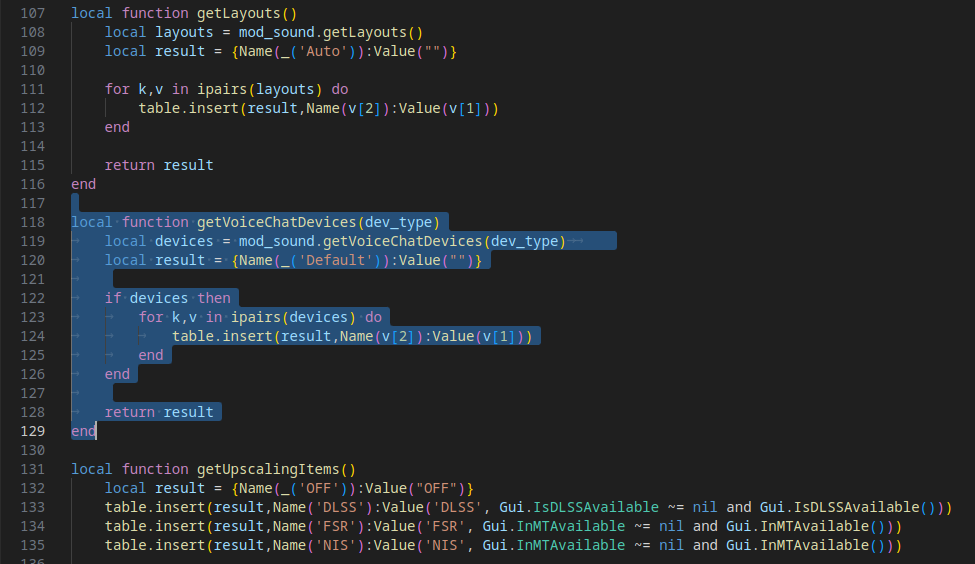
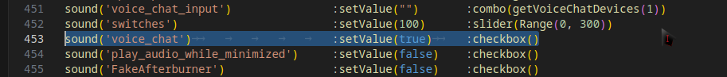
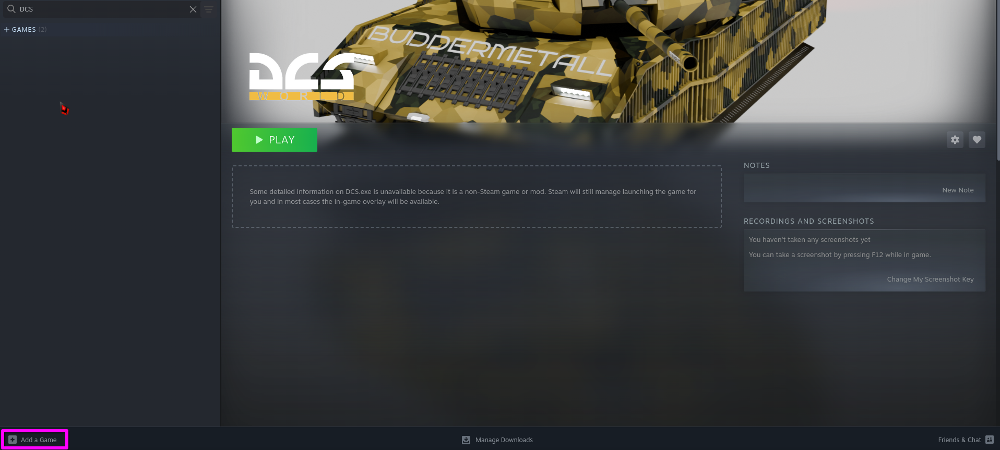

# DCS Standalone on Linux Via Wine(Lutris)/Proton(Steam)
#### Any and all refrences to Steam, are not relating to the Steam version of the game.

DCS World can run on linux through Wine and Proton, though it does take some
work to get running and if you want to use VR I highly recommend using Proton(Steam) as opposed to Wine, if anything dosen't work, make sure I cannot stress this enough
CHECK all your log files.

Thanks to everyone who has helped getting the game running and debugging issues
in the [Proton issuetracker](https://github.com/ValveSoftware/Proton/issues/1722)
and in the [Matrix chat](https://matrix.to/#/#dcs-on-linux:matrix.org).  
Unfortunately, workarounds easily get buried there and the OG of this Doc is outdated  
(I will try to keep this one up to date but I make no promises)  
**last update:4/24/2025**  

## Contents

   * [Installation](#Getting-it-installed-via-Lutris)
      * [Lutris](#getting-it-working-with-Lutris)
      * [Black screen Launcher bypass](#Black-screen-launcher-bypass)
      * [Native-Voice-Chat-Bug](#Native-Voice-Chat-Bug)
      * [Porting to Steam(BROKEN)](#Porting-to-Steam(BROKEN))
   * [Bugs and Fixes](#known-issues-and-fixes)
      * [System ram leak](#system-ram-leak)
      * [Broken Contrails](#Contrails-are-puffy/broken-up)
      * [fx_5_0 error](#fx_5_0-error-shaders-not-compiling)
      * [Apache Crashes Game](#Apache-crashes-game)
      * [MFD/Sight texture bug](#-AH-64/F-18/Ka-50/Mi-24P-MFD/sights-broken)
   * [Vr References](#Vr-References)
   * [3rd party programs/tools](#3rd-party-programs/tools)
      * [Headtracking](#headtracking)
      * [SRS](#simple-radio-standalone-srs)
   * [Scripts](#Scripts)
      * [DCS shader delete](#dcs-shader-delete)
      * [Texture convert](#texture-convert)
   * [Installing Mods](#Installing-Mods)
## Getting it installed via Lutris

There are [two install scripts
for standalone](https://lutris.net/games/dcs-world/) on Lutris

I used the latter labeled Standalone Open Beta version, but they both should work as DCS no longer has an "OpenBeta" and I believe that the install scripts may be borked. this will download, the DCS updater and you should install the game.

### Getting it working with Lutris
This step should be by the lutris installer, but check just in case.
Start the game once first to create the prefix(here for an explination of what a prefix is), then use lutris's Winetricks to add these .dll and font.

vcrun2019(optional causes issues) corefonts xact d3dcompiler_47

you can open Winetricks in lutris by clicking on DCS Do not open, 1 LMB click only, then click on the Wine glass at the bottom of the screen
Winetricks

You need to add a "dll override" aswell. As of 2.9.12, `wbemprox=n` needs to be overridden.
In lutris, you can do so under "runner options".


## Duplicate Lutris Config
before you move on, you should have an install via lutris that opens the DCS_Updater.exe
make sure you have used it to install the game files at this point and duplicate the confg
in lutris, then change the duplicated lutris config to launch the DCS.exe MT or not, dosen't matter
we will be working with the duplicated one, not the original

## Black screen launcher bypass

So at this point you should get a black screen a little bit smaller than your display that'll be the launcher
you'll need to add this the the launch arguments of Lutris `--no-launcher`
you can do so under "game options" in the arguments field

## VR with Lutris

Use Envision to setup your VR Headset. You'll also want to have Steam, SteamVR, and Proton Experimental(other versions of Proton may work, but weren't tested, and we're not actually using steam vr, it's needed to calibrate in envision)

In lutris, select DCS, click the arrow beside Play, and select configure then nder the Game Options tab, 
```--no-launcher --force_enable_VR --force_OpenXR```
go in the arguments field.

Under the System Options tab, in the Environment Variables section, click add.
First KEY is 
```PRESSURE_VESSEL_FILESYSTEMS_RW```
VALUE
```/run/user/1000/monado_comp_ipc```

then click add again
KEY
```XR_RUNTIME_JSON```
VALUE
```/home/$USER/.local/share/envision/prefixes/lighthouse_default/share/openxr/1/openxr_monado.json```
You can also click the 3 dots in Envision to copy the environment variables, if you're not using the default envision profiles

you have two options from here, proceede with Wine or use Proton under Steam(Recommended for VR)

#### (updated for 2.9.12.5336)

If you plan on using DCS with a VR headset you'll want to use Proton and the easiest way i've found
to get it working, is through Steam(not the Steam version of the game but adding
the game to Steam) however keep working with Wine and Lutris for now

If you would rather use headtracking via opentrack  
I'd recommend you keep using Wine as opentrack does not support the steam method

## Native Voice Chat black screen Bug
### NOTE: the following dosen't seem to always be an issue
#### If you proceed  you will have to redo this step every time you repair the game and possibly when ED updates the optionDB.lua
see [Porting to Steam](#Porting-to-Steam) for using Proton(Via Steam), just skip this step

I have a workaround for this problem however it removes the in game voice chat functionality
witch I find to be a downside but `¯\_(ツ)_/¯`

you'll need to modify the optionsDB.lua(modified ver included at the top of page) located at   
```/INSTALL_DIR/MissionEditor/modules/Options/optionsDb.lua```  
and remove the calls to voicechat on lines 118-129 and 453 look for the lines highlighted in the following 2 pictures,



The game should now start.


## Porting-to-Steam(BROKEN)

so first thing you're gonna want to do is add the DCS.exe as a Steam game



then add these launch options(some debug info, and the no launcher option from before)  
```WineDLLOVERRIDES="wbemprox=n" WineDEBUG="+timestamp,+pid,+tid,+seh,+debugstr,+module" %command% --no-launcher```  
optionally you can add the gamemoderun command, however that requres you have gamemode installed  
```WineDLLOVERRIDES="wbemprox=n" WineDEBUG="+timestamp,+pid,+tid,+seh,+debugstr,+module" gamemoderun %command% --no-launcher```  

also I found the most sucess with Proton experimental but try different ones out see what works

now that that's done, launch it to create the prefix in Steam
you need to add the userdata from the Wine prefix to the Steam prefix

Steam Proton prefixes are stored in the compatdata folder usually around here   
```/home/<USRNAME>/.local/share/Steam/Steamapps/compatdata/```   
now once you're there, youll see a lot of numbered folders, one of those is the
new DCS prefix, it's probably going to be one of the longer ones  
it might be easier to find yours if you sort by creation date it should be the first/last one.

now that you've found the Steam Proton prefix, you need to link(I used a symlink) the Saved Games folder   
```/pfx/drive_c/users/Steamuser/Saved Games/```   
to the one in your lutris install for instance the command I used in arch was:   
```<USERNAME>@PC ~> ln -s /home/<USERNAME>/Games/dcs-world/drive_c/users/<USERNAME>/Saved\ Games/ /home/<USERNAME>/.local/share/Steam/Steamapps/compatdata/2824223594/pfx/drive_c/users/Steamuser/```  
### On Arch a filepath with spaces can either be added with ["/File Path/"] or [/File\ Path/] different systems may vary, check your respective wiki

## Known issues and fixes

If things go wrong, the primary thing to look for is the game log - 
`drive_c/users/$USERNAME/Saved Games/DCS<possibly openbeta>/Logs/dcs.log`.
After crashes, the crash reporter will spam a bit about various DLLs being used
recently, and just before that, the cause of the crash should be visible and if that
yelds no result try turning it off and back on again(your PC/Device) lol.

Sometimes crashes happen before the game gets far enough to create a log file.
Then your best bet is to read the Proton/Wine output. You can easily get
this by starting them from a terminal, or in the case of steam, try adding these environment variables
```
PROTON_LOG=1
PROTON_LOG_DIR=/path-to-desired-directory/
```
set that directory and steam will dump log files there


If you can't find your issue, or have found a solution for one, please discuss it in
the [matix](https://matrix.to/#/#dcs-on-linux:matrix.org) chat or in [ED's Discord server](https://discord.com/invite/eagledynamics) so I can update the guide

## System ram leak
when using the VCrun 2019 package, proton tends to fall flat on it's face attempting to load some of the .dll's and this causes an infinite loop that eats up all of your ram, the easiest fix is to remove/overwrite VCrun2019 with either 2015 or 2022

## Contrails are puffy/broken up
yeah it's like that, I dont know why but it can be ignored if you fix it let me know supposably there's a fix, I'll update the guide when it is made to work and I can confirm it

## fx_5_0 error shaders not compiling
this is usually caused by d3dcompiler being missing, make sure you have d3dcompiler_47
if that still dosent work try launching the DCSupdater.exe via lutris

## Apache crashes game
This is caused by a missing font, `seguisym.ttf` it is a font that is not avalable for redistribution, ie: cannot be legally obtained on Linux so I unfortunately cannot tell you how to obtain it
but if you can get your hands on a copy of `C:/Windows/Fonts` than that will fix your issue, you can also use an existing font on your disto that supports all of the required characters and rename it to `seguisym.ttf`  

## AH-64/F-18/Ka-50/Mi-24P MFD/sights broken

see [texture reformat](#texture-reformat)

# Vr References

As far as VR on linux is concerned your milage may vary but, if you havent at least attempted it before
this should get you started [Linux VR Adventures discord](https://discord.gg/qdUWFe4RDV) this is where I go to ask all of my questions about Monado and Envision
# 3rd party programs/tools

## headtracking
Opentrack is a 3rd party headtracking software that can use headtracker hardware (but not trackIR, unless doing some weird workarounds). Note that opentrack will need to inject-at-runtime to your prefix with a new program, so this can break some of your env vars.
https://github.com/markx86/opentrack-launcher?tab=readme-ov-file#with-Steam-flatpak

LinuxTrack can use trackIR hardware, and there are forks that have updated the version of QT it runs on. May require manual key extraction or non-staging system wine to work.
https://github.com/uglyDwarf/linuxtrack

## Simple Radio Standalone (SRS)
SRS is the standard basically every server uses for radios, as it has far more functionality than vanilla and has existed far longer. Thankfully, SRS installations use localhost networking to pipe data from the game so we dont need to install it in the same prefix to work, and they dont need to inject to the prefix like opentrack does. To install SRS, you could install it to your dcs prefix, or, the better option, is to install SRS to its own prefix. Many have issues on wine/proton versions above 8.x. 8.26 proton GE is confirmed to work(Chaos). to install SRS, grab the files from github releases at https://github.com/ciribob/DCS-SimpleRadioStandalone and put them into your 8.x prefix. then open the readme.txt it comes with for manual installation instructions of the hook. If you are feeling lazy, you may be able to use the autoinstaller run under the game prefix to auto-install the hooks to the game. Once this is done, just launch srs and the game however you please if they are in their own prefixes, and they will connect via localhost networking.

# Scripts
You can run a script as if it were an executable file by making a `.sh` file with the contents 

## DCS Shader delete

this script deletes the DCS shader directory and remakes the dir without the contents as it is advised by ED to do so every update you will need to change the filepath and possibly the .openbeta

```
rm -rf 'INSTALL_DIR/drive_c/users/<USERNAME>/Saved Games/DCS.openbeta/metashaders2/'
rm -rf 'INSTALL_DIR/drive_c/users/<USERNAME>/Saved Games/DCS.openbeta/fxo/'
mkdir 'INSTALL_DIR/drive_c/users/<USERNAME>/Saved Games/DCS.openbeta/metashaders2/'
mkdir 'INSTALL_DIR/drive_c/users/<USERNAME>/Saved Games/DCS.openbeta/fxo/'
```
## Texture convert

Native the above listed aircraft have issues with sight/mfd textures not working due to image format issues with Wine/Proton the fix requires you to convert the textures so that they are compatable with Wine/Proton rendering pipelines, unfortunately this breaks Pure Texture IC see the original post [here](https://github.com/ValveSoftware/Proton/issues/1722#issuecomment-2116194839), you will need to redo this every time you repair the game as it will overwrite these rexported textures with the original ones

For this script to work you will need the [imagemagick](https://imagemagick.org/index.php) package, you may need to edit the script so that it works on your install of DCS and you will need to change the filepath, also I wouldent remove the extra files like the Mi-24 and Ka-50 just incase you get them later so that you dont have to remember to come back to this page

[Original Script](https://github.com/ValveSoftware/Proton/issues/1722#issuecomment-2116194839)  
[Edited Script](DCSApachetextureconvert.txt):  
```
#!/bin/bash

DCS_INSTALL="/home/<USERNAME>/Games/dcs-world/drive_c/Program Files/Eagle Dynamics/DCS World OpenBeta"

BROKEN_FILES="Mods/aircraft/AH-64D/Cockpit/IndicationResources/Displays/MPD/FontMPD_64.tga
Mods/aircraft/AH-64D/Cockpit/IndicationResources/Displays/EUFD_font.dds
Mods/aircraft/AH-64D/Cockpit/IndicationResources/Displays/KU_font_8p.dds
Mods/aircraft/AH-64D/Cockpit/IndicationResources/Displays/TADS_symbology.dds
Mods/aircraft/AH-64D/Cockpit/IndicationResources/Displays/TEDAC/TEDAC_day.dds
Mods/aircraft/AH-64D/Cockpit/IndicationResources/Displays/TEDAC/TEDAC_FCR_indication_font.dds
Mods/aircraft/AH-64D/Cockpit/IndicationResources/Displays/TEDAC/TEDAC_FCR_Target_font.dds
Mods/aircraft/AH-64D/Cockpit/IndicationResources/Displays/TEDAC/TEDAC_font.dds
Mods/aircraft/AH-64D/Cockpit/IndicationResources/Displays/TEDAC/TEDAC_night.dds
Mods/aircraft/AH-64D/Cockpit/IndicationResources/Displays/TEDAC/TEDAC_symbology.dds
Mods/aircraft/AH-64D/Cockpit/IndicationResources/Displays/MPD/FontMPD_64_inv.tga
Mods/aircraft/AH-64D/Cockpit/IndicationResources/Displays/MPD/FontMPD_64_inv_bold.tga
Mods/aircraft/AH-64D/Cockpit/IndicationResources/Displays/MPD/indication_MPD.tga
Mods/aircraft/AH-64D/Cockpit/IndicationResources/Displays/MPD/indication_MPD_1024.dds
Mods/aircraft/AH-64D/Cockpit/IndicationResources/Displays/MPD/indication_MPD_WPN.tga
Mods/aircraft/AH-64D/Cockpit/IndicationResources/Displays/MPD/indication_MPD_WPN_fon.tga
Mods/aircraft/AH-64D/Cockpit/IndicationResources/Displays/MPD/MFD_dark_green.dds
Mods/aircraft/AH-64D/Cockpit/IndicationResources/Displays/MPD/MFD_gray.dds
Mods/aircraft/AH-64D/Cockpit/IndicationResources/Displays/MPD/MFD_green.dds
Mods/aircraft/AH-64D/Cockpit/IndicationResources/Displays/MPD/MFD_white.dds
Mods/aircraft/AH-64D/Cockpit/IndicationResources/Displays/MPD/MPD_FCR_indication_font.dds
Mods/aircraft/AH-64D/Cockpit/IndicationResources/Displays/MPD/MPD_FCR_Target_font.dds
Mods/aircraft/AH-64D/Cockpit/IndicationResources/Displays/MPD/MPD_VideoSymbology.dds
Mods/aircraft/AH-64D/Cockpit/IndicationResources/Displays/MPD/MPD_VideoSymbology_font.dds
Mods/aircraft/Mi-24P/Cockpit/IndicationTextures/9K113_bg.tga
Mods/aircraft/Mi-24P/Cockpit/IndicationTextures/9K113_Fixed_Grid.tga
Mods/aircraft/Mi-24P/Cockpit/IndicationTextures/9K113_Grid_3x.tga
Mods/aircraft/Mi-24P/Cockpit/IndicationTextures/9K113_Grid_3x_backlight.tga
Mods/aircraft/Mi-24P/Cockpit/IndicationTextures/9K113_Grid_10x.tga
Mods/aircraft/Mi-24P/Cockpit/IndicationTextures/9K113_Grid_10x_backlight.tga
Mods/aircraft/Mi-24P/Cockpit/IndicationTextures/9K113_Ready.tga
Mods/aircraft/Mi-24P/Cockpit/IndicationTextures/ASP17_flex_sight.tga
Mods/aircraft/Mi-24P/Cockpit/IndicationTextures/font_arcade.tga
Mods/aircraft/Mi-24P/Cockpit/IndicationTextures/font_general.tga
Mods/aircraft/Mi-24P/Cockpit/IndicationTextures/GOST_BU.TTF
Mods/aircraft/Mi-24P/Cockpit/IndicationTextures/HelperAI_common.dds
Mods/aircraft/Mi-24P/Cockpit/IndicationTextures/PKV_Grid.tga
Mods/aircraft/Ka-50_3/Cockpit/IndicationTextures/SHKVAL_MASK.bmp"

while read -r file; do
    FULL_PATH="$DCS_INSTALL/$file"
    echo "Converting ${FULL_PATH}"
    cp "${FULL_PATH}" "${FULL_PATH}.original"
    magick "${FULL_PATH}" "${FULL_PATH}"
done <<< "$BROKEN_FILES"
```

# Installing Mods
If you are using Lutris/Steam, you can just navigate to the Original prefix and install them as you would on Windows, alternatively you can use a mod manager such as Limo to manage your mods. You can specify the directories same as windows users. Limo will also allow you to run scripts from it, so shell scripts that need to run on update, or uninstalling mods for an update to prevent corruption, can be easilly managed and run via Limo. You can install it as a flatpak with no drawbacks. https://github.com/limo-app/limo/wiki
